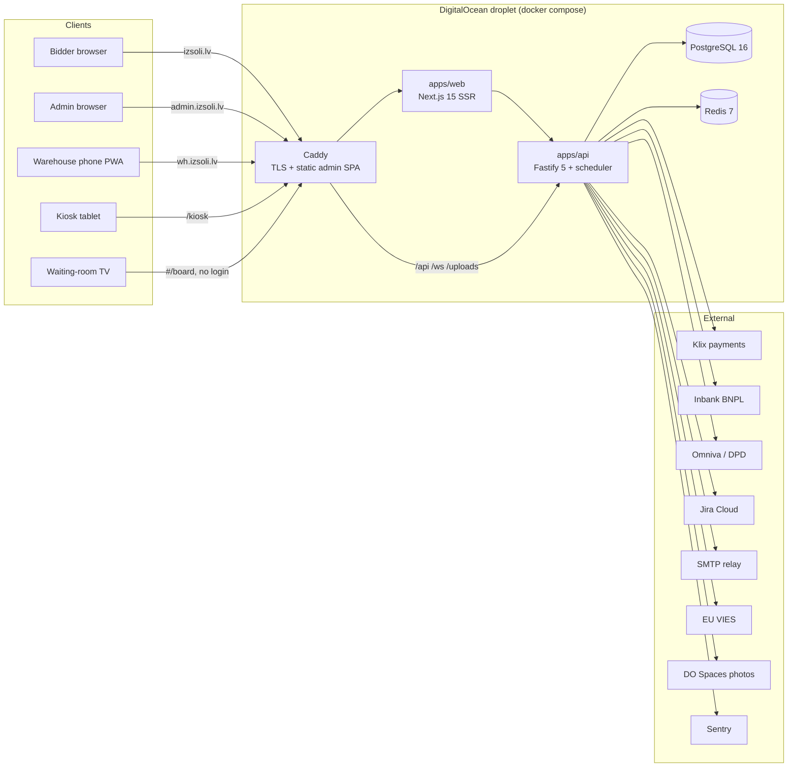

# 01 — Architecture

## System overview

- **PostgreSQL is the single source of truth**; Redis holds only locks,
  throttle markers, caches, rate-limit counters and pub/sub channels. There is
  no job queue — the `notifications` outbox table plus a 1-second scheduler
  tick *is* the queue.
- **All money is integer euro cents** end-to-end. Floats never touch money.
- **One SPA build, two hosts**: `admin.` and `wh.` serve byte-identical
  bundles; the app detects the `wh.` host and locks itself to warehouse mode.
- **Live updates** flow Redis pub/sub → WebSocket (`/ws`). Payloads are made
  public-safe at publish time: reserve amounts, proxy maxima and PII never
  reach a socket.

## Monorepo layout

pnpm workspaces (`pnpm-workspace.yaml`), Node ≥ 20, TypeScript ESM everywhere.

| Path | Package | What it is |
|---|---|---|
| `packages/domain` | `@auction/domain` | Pure business logic — zero I/O, only `node:crypto`. Proxy-bid resolver, increments, anti-snipe, state machines, invoice/VAT math, VIES rules, TOTP, password policy, pickup/warehouse math, condition & category taxonomies. Exhaustively unit-tested. |
| `packages/db` | `@auction/db` | Drizzle ORM schema (39 tables), SQL migrations (drizzle-kit), scrypt password hashing, seed (markets/roles/demo data), `bootstrapAdmin`. |
| `apps/api` | `@auction/api` | Fastify 5 — REST + WebSocket, auction engine runtime, JWT auth + mandatory TOTP 2FA, action-level RBAC, the 1 s scheduler, all provider clients. |
| `apps/admin` | `@auction/admin` | Vite + React 19 operator SPA: 18 screens, browser-style tabs + split view + ⌘K, warehouse phone mode, TV boards. |
| `apps/web` | `@auction/web` | Next.js 15 public storefront: SSR catalog, live bidding over WS, bidder accounts, kiosk, CMS pages, per-ccTLD SEO, 5 languages. |
| `apps/e2e` | `@auction/e2e` | Playwright suite that boots the real API + storefront and drives full user journeys. |
| `deploy/` | — | Production compose file, Dockerfiles, Caddyfile, `.env.example`, nightly backup script. |
| `docs/` | — | This handbook, deploy runbook, launch checklist, roadmap, pickup-ERP design. |

**Dependency direction:** `domain` ← `db` ← `api` ← (admin/web talk HTTP only).
The domain package must build first — `pnpm build` at the root handles order.

## Key design principles

1. **Pure resolver inside a row lock.** Bid resolution (`resolveBid`) is a pure
   function; the API runs it inside a transaction holding `SELECT … FOR UPDATE`
   on the auction row. Concurrency safety is proven by a 60-simultaneous-bidders
   test producing a gap-free, replay-consistent ledger.
2. **State machines are law.** Auction, item, and pickup-ticket statuses are
   plain text columns validated exclusively through domain
   `assert*Transition` guards. Adding a state is a domain-only change.
3. **Append-only ledgers.** `bids`, `stock_movements`, `audit_log`, `refunds`
   are never updated destructively (bids can be voided, not deleted).
4. **Snapshot columns.** Orders/invoices/audit rows snapshot aliases, emails
   and labels so GDPR erasure never breaks history and never re-mails anyone.
5. **Hidden columns stay hidden.** `listings.reserve_cents`,
   `auctions.leader_max_cents`, `bids.max_cents` are stripped from every
   public payload (`auctionDto`, `publicAuction`) and every WS event.
6. **Provider seams with modes.** Every external provider follows
   `<X>_MODE = off | live | simulate`: `create<X>Client()` returns `null`
   when off (feature hides itself), a simulator for tests, or the live client.
   Callbacks are hints, never proof — settlement always re-fetches from the
   provider.
7. **Counters under row locks.** Order refs, SKUs, consignment refs, invoice
   numbers and daily ticket numbers come from the `counters` table incremented
   under a row lock — gap-free and race-safe.
8. **Config over code.** VAT rates, buyer premium, increment tables,
   anti-snipe, pickup deadlines and restock fees live in the `markets` table,
   editable in Settings — never a code change.

## Request/data flow examples

**A bid from the storefront:**
`POST /api/public/auctions/:id/bids` → auction row locked → guards (live, not
blocked, no outstanding fees) → `resolveBid` (pure) → `applyAntiSnipe` →
ledger rows inserted + outbid notification enqueued *in the same transaction*
→ commit → public-safe `bid` event published to Redis → WebSocket fan-out to
every watcher (anonymous included) → admin monitor and lot page update live.

**An auction closing:**
scheduler tick (Redis-locked, 1 s) finds `ends_at <= now` → `closeAuction`
under the row lock → outcome decided → winner order created (hammer + 10%
premium + VAT, reverse-charge aware) → sequential invoice issued (counter row
lock) → item lifecycle advanced → `won` email with pay link enqueued →
`closed` event published.

**An IT reply in Jira:**
Jira webhook (`?secret=`) or 5-min sweep or chat-open pull → `syncOneReport`
→ new comment row (`side: "it"`) → reporter emailed ("IT atbildēja — IZS-n")
→ `bug_reply` admin WS event → 🐞 sidebar badge updates instantly.
